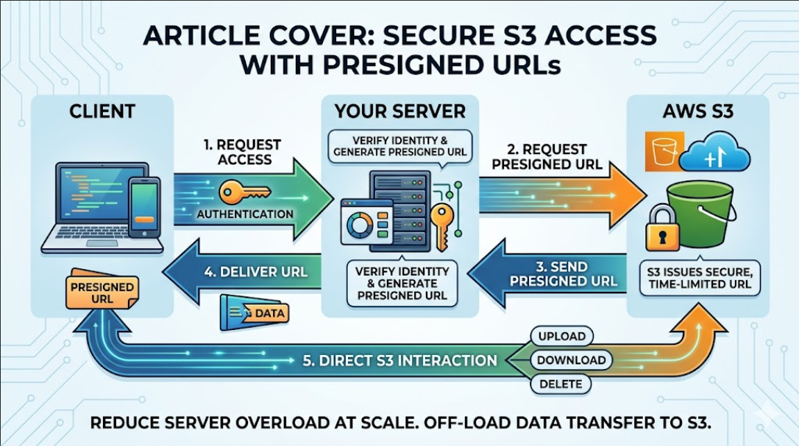

# Presigned S3 Vault

A Python-based Streamlit application that **demonstrates scalable file operations on Amazon S3 using presigned URLs**. The system enables **upload, download, and delete** operations without exposing AWS credentials to the client side.

Instead of files moving from the client to the server and then to S3, the client can now directly interact with S3 using presigned URLs.

## Features

- Generate presigned URLs for S3 operations:
  - Upload (`PUT`)
  - Download (`GET`)
  - Delete (`DELETE`)
- Bucket and object key selection via UI
- Config-driven AWS client setup
- Time-limited secure access to S3 objects
- Separation of UI, core logic, and AWS integration

## Architecture



## Project Setup

### Clone the Repository

```bash
git clone https://github.com/Harisudhan5/Presigned-S3-Vault.git
cd Presigned-S3-Vault
```

### Install UV Package Manager

#### Windows (PowerShell)

```powershell
powershell -ExecutionPolicy ByPass -c "irm https://astral.sh/uv/install.ps1 | iex"
```

#### Linux / macOS

```bash
curl -LsSf https://astral.sh/uv/install.sh | sh
```

### Create Virtual Environment

```bash
uv venv --python 3.12 --seed
```

### Activate the Environment

#### Windows

```powershell
.venv\Scripts\activate
```

#### Linux / macOS

```bash
source .venv/bin/activate
```

### Install Dependencies

```bash
uv sync
```

### Run the Application

```bash
streamlit run main.py
```

## AWS Setup

### 1. Create an S3 Bucket

Create an S3 bucket in your preferred AWS region.

### 2. Create an IAM User

Create an IAM user with permissions required for the operations you want to perform:

```text
s3:GetObject
s3:PutObject
s3:DeleteObject
```

Generate an Access Key for the IAM user and securely store the credentials.

Alternatively, you can modify the application to use an IAM Role instead of access keys, which is the recommended approach for production deployments.

### 3. Gather the Required Information

You will need the following details:

- AWS Access Key ID
- AWS Secret Access Key
- AWS Region
- S3 Bucket Name
- Object Key (for upload, download, or delete operations)

> **Note:** The repository includes `s3-policy-template.json`, which can be used as a quick reference for configuring the required IAM inline policy.

### 4. Configure the Application

Provide the AWS credentials and S3 details through the application's configuration or UI before generating presigned URLs.